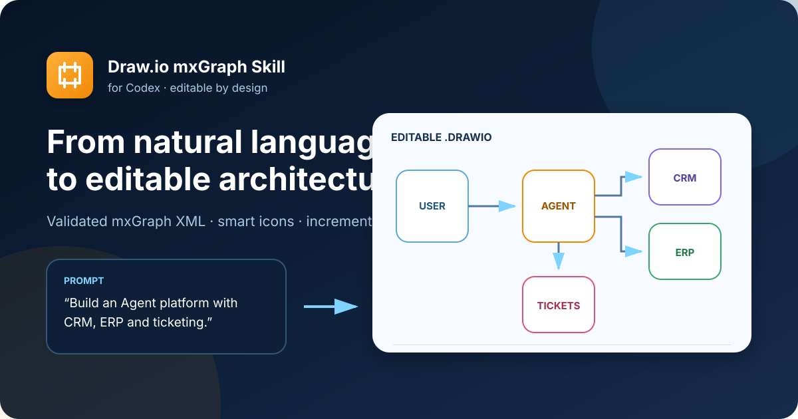

# Draw.io mxGraph Skill for Codex

[](https://github.com/clawcode3-bit/drawio-mxgraph-skill/releases)
[](LICENSE)
[](https://app.diagrams.net/)
[](https://github.com/clawcode3-bit/drawio-mxgraph-skill/stargazers)

English | [简体中文](README.zh-CN.md)

Turn natural-language architecture and process descriptions into **validated, editable Draw.io diagrams**—not flattened screenshots.

The skill generates portable mxGraph XML, selects relevant AWS, Microsoft Fluent, Iconify, or native Draw.io symbols, routes orthogonal connectors, and supports incremental edits without rebuilding the diagram by hand.



## Why this project?

AI diagram generators often produce attractive images that are difficult to maintain. This project treats the diagram as structured data:

- every node keeps a stable ID;
- every connector has a valid source and target;
- icons can be embedded for portable offline editing;
- layout and grouping can change incrementally;
- the final `.drawio` file remains editable in diagrams.net.

## Highlights

| Capability | What it provides |
| --- | --- |
| Natural language to Draw.io | Architecture diagrams, workflows, integration maps, and flowcharts |
| Incremental editing | Add, remove, move, rename, connect, group, and ungroup nodes |
| Layout control | `LR`, `RL`, `TB`, and `BT` directions |
| Smart icons | Native Draw.io shapes plus Iconify, AWS, and Microsoft Fluent icons |
| Portable files | SVG icons embedded as data URIs so they do not disappear offline |
| Cleaner routing | Orthogonal connectors, explicit waypoints, and opaque edge-label backgrounds |
| Validation | XML structure, unique IDs, edge references, geometry, and embedded icon checks |

## Quick start

### Install as a Codex Skill

```bash
git clone https://github.com/clawcode3-bit/drawio-mxgraph-skill.git
cp -R drawio-mxgraph-skill/drawio-mxgraph ~/.codex/skills/
```

Restart Codex, then ask:

```text
Use $drawio-mxgraph to create an Agent platform architecture diagram
with User, API Gateway, AgentBuilder, LLM, Knowledge Base, CRM, ERP,
and Ticketing System. Use square icon tiles and a left-to-right layout.
```

### Use the generator directly

```bash
python3 drawio-mxgraph/scripts/drawio_tool.py \
  build \
  --spec examples/agentbuilder-customer-service-architecture.json \
  --output architecture.drawio
```

Validate the result:

```bash
python3 drawio-mxgraph/scripts/drawio_tool.py \
  validate architecture.drawio
```

Open `architecture.drawio` in [diagrams.net](https://app.diagrams.net/) and continue editing.

## Incremental edits

The edit command accepts structured operations such as:

- `add_node`
- `update_node`
- `remove_node`
- `move_node`
- `add_edge`
- `remove_edge`
- `group`
- `ungroup`
- `set_layout`

Example operation file:

```json
{
  "operations": [
    {
      "op": "move_node",
      "id": "agent",
      "x": 720,
      "y": 240
    },
    {
      "op": "update_node",
      "id": "agent",
      "label": "Customer Service Agent"
    },
    {
      "op": "set_layout",
      "direction": "LR"
    }
  ]
}
```

Apply it:

```bash
python3 drawio-mxgraph/scripts/drawio_tool.py \
  edit \
  --input architecture.drawio \
  --ops operations.json \
  --output architecture-v2.drawio
```

## Included examples

The `examples/` directory contains an editable AgentBuilder customer-service solution:

- omnichannel customer access;
- AgentBuilder orchestration and specialized agents;
- knowledge Q&A, business transactions, and complaint handling;
- CRM, ERP, and ticketing-system integration;
- LLM, knowledge, data, guardrails, and observability layers;
- human-agent collaboration and operations analytics.

Both the architecture diagram and the end-to-end process flow are included as JSON specifications and `.drawio` files.

## Repository structure

```text
.
├── drawio-mxgraph/               # Installable Codex Skill
│   ├── SKILL.md
│   ├── agents/openai.yaml
│   ├── scripts/drawio_tool.py
│   ├── references/
│   └── assets/
├── examples/                     # Editable AgentBuilder examples
├── docs/                         # Repository visuals
└── README.zh-CN.md
```

## Icon support

The generator can use native Draw.io shapes and Iconify collections. Downloaded SVG icons are embedded in the generated file as data URIs.

The first use of an uncached Iconify icon requires network access. Icon collections and third-party trademarks remain subject to their own licenses and brand guidelines. This project is not affiliated with AWS, Microsoft, Iconify, or diagrams.net.

## Requirements

- Python 3.10+
- Codex Skills
- diagrams.net / Draw.io for visual editing
- network access only when downloading an uncached Iconify icon

## Contributing

Bug reports, icon mappings, layout improvements, and new examples are welcome. See [CONTRIBUTING.md](CONTRIBUTING.md).

If this project saves you time, consider giving it a ⭐. It helps other developers discover the skill.

## License

The project code is licensed under the [MIT License](LICENSE). Third-party icons and trademarks keep their respective licenses.
